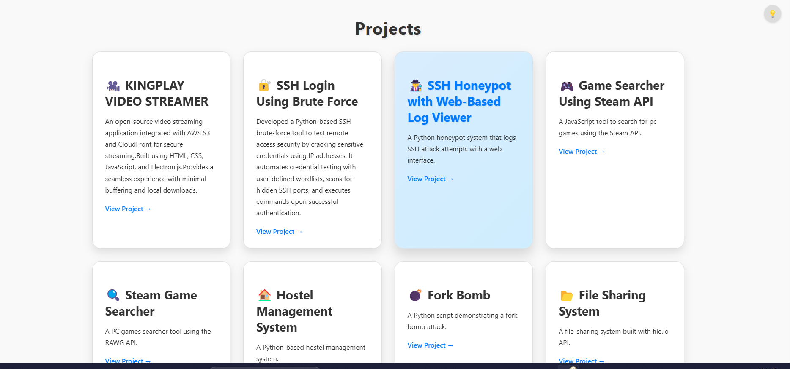

# Projects-showcase

# 🚀 Projects Showcase

A modern, responsive portfolio page displaying all your projects in a visually appealing grid layout. Built with HTML, CSS, and JavaScript, featuring dark mode, smooth animations, and an interactive UI.

## ✨ Features

- 🌑 **Dark Mode Toggle**
- 🎨 **Smooth UI Animations**
- 🏗 **Responsive Grid Layout**
- 🔗 **Direct GitHub Links for Each Project**
- 🖥 **Minimalistic & Clean Design**

## 📸 Preview



## 🛠 Tech Stack

- **HTML5**
- **CSS3**
- **JavaScript**

## 📂 Installation & Usage

1. Clone the repository:
   ```bash
   git clone https://github.com/kingslayer458/projects-showcase.git
   ```
2. Open `index.html` in your browser.

## 🌓 Dark Mode

Click the 💡 button in the top-right corner to toggle dark mode. Preference is saved using `localStorage`.

## 🎯 Projects Included

- **KINGPLAY Video Streamer** 🎥
- **SSH Login Brute Force Tool** 🔐
- **SSH Honeypot with Web Log Viewer** 🕵️
- **Game Searcher (Steam API & RAWG API)** 🎮
- **Hostel Management System** 🏠
- **Real-Time Chat App (Socket.IO)** 💬
- **And More!** 🚀

## 📜 License

This project is licensed under the MIT License.

## 🤝 Contributing

Feel free to submit issues or pull requests to improve this project!

### ⭐ Show Your Support
If you like this project, consider giving it a ⭐ on GitHub!
